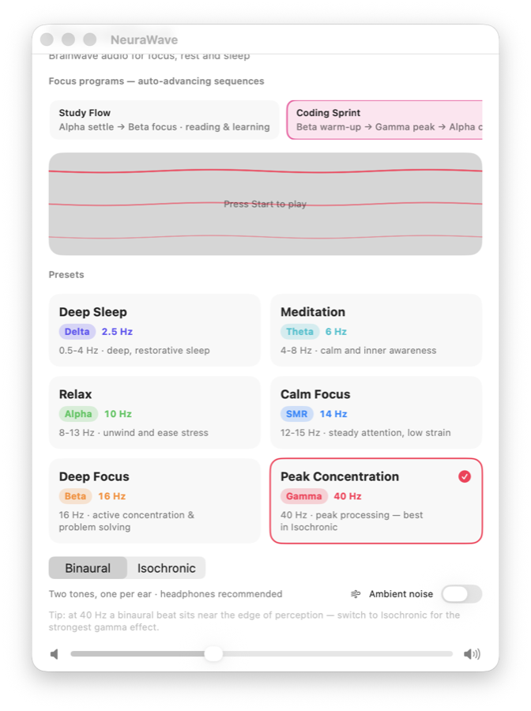

# 🌊 NeuraWave

**Brainwave audio for focus, rest and sleep** — a tiny, native macOS app that plays
scientifically-tuned binaural and isochronic tones, with smart focus programs and a
menu bar that never gets in your way.

[](https://github.com/AkiyamaKunka/NeuraWave/actions)
[](LICENSE)
[]()
[](https://github.com/AkiyamaKunka/NeuraWave/releases)



## Why NeuraWave

- **Frequencies tuned to the evidence, not the hype.** Deep Focus runs at 16 Hz
  (the beta rate Lane et al., 1998, actually tested for vigilance), Calm Focus at
  14 Hz SMR, and 40 Hz gamma ships with the honest advice that it works best in
  Isochronic mode. Full rationale in [RESEARCH.md](RESEARCH.md).
- **Focus programs** that think ahead: settle in with Alpha, then ramp into the
  work band — Study Flow, Coding Sprint, and Mental Rest. Presets auto-advance
  through a **click-free crossfade**.
- **Lives in the menu bar.** Closes to a menu bar icon, starts at login silently
  (no sound until you press Start), and quits only when you actually quit it.
- **Zero noise.** No accounts, no analytics, no network calls. Your Mac stays
  awake during sessions; it remembers your settings between launches.

## Install

1. Grab **NeuraWave-1.3.0.dmg** from [Releases](https://github.com/AkiyamaKunka/NeuraWave/releases).
2. Open the DMG and drag NeuraWave into Applications.
3. First launch: **right-click the app → Open** (the app is ad-hoc signed, so
   Gatekeeper asks once; after that it launches normally).

> Want it frictionless? It needs Apple Developer ID signing + notarization
> (a $99/year Apple Developer Program account). The CI is ready for it.

## Presets

| Preset | Band | Beat | Best for |
| --- | --- | --- | --- |
| Deep Sleep | Delta | 2.5 Hz | Deep, restorative sleep |
| Meditation | Theta | 6 Hz | Calm and inner awareness |
| Relax | Alpha | 10 Hz | Unwinding and stress relief |
| Calm Focus | SMR | 14 Hz | Steady attention, low strain |
| Deep Focus | Beta | 16 Hz | Active concentration and coding |
| Peak Concentration | Gamma | 40 Hz | Peak processing (best in Isochronic) |

## Focus programs

Timed sequences that auto-advance with a click-free crossfade.

| Program | Sequence | Total |
| --- | --- | --- |
| Study Flow | Alpha settle (10 min) → Beta focus (30 min) | 40 min |
| Coding Sprint | Beta warm-up (8 min) → Gamma peak (30 min) → Alpha cool-down (5 min) | 43 min |
| Mental Rest | Alpha (6 min) → Theta (20 min) → Alpha return (4 min) | 30 min |

## Features

- Binaural tones (headphones recommended) and isochronic tones (work with speakers)
- Optional pink-noise layer to mask distracting background sounds
- Volume control and a session timer (no timer, 15, 30, 45, 60, or 90 minutes)
- Click-free switching: presets and tone styles crossfade through silence instead of cutting
- Smooth fade-in and fade-out; the Mac stays awake during a session
- Keeps playing when the window closes; menu bar item for start/stop, countdown, and quit
- Starts at login (menu bar only; no sound until you press Start) — toggle via the menu bar's "Launch at Login"
- Quits only from the menu bar's Quit or Cmd+Q — closing or minimizing never stops it
- Remembers your last preset, tone style, volume, noise, timer, and program between launches

## The science

NeuraWave is honest about the evidence: binaural beats show a medium effect in
meta-analysis (Garcia-Argibay et al., 2019, g ≈ 0.45) with real but weak cortical
entrainment (Orozco Perez et al., 2020), and effects vary by person. Every design
decision — frequencies, program structure, gamma-in-isochronic — is documented
with sources in [RESEARCH.md](RESEARCH.md).

## Build from source

```bash
swift build                          # debug build
bash scripts/package-app.sh release  # assembles build/NeuraWave.app
```

## Testing

The app has a hidden self-test mode that exercises every preset, tone style,
noise setting, volume change, timer, and stop/restart path:

```bash
# 8-second smoke test, switching configuration every 2 seconds
build/NeuraWave.app/Contents/MacOS/NeuraWave --autotest --autotest-seconds 8 --autotest-cycle 2

# The full battery with pass/fail reporting — including the 30-minute
# endurance run — is bash scripts/run-tests.sh
```

CI on GitHub Actions builds and runs the smoke, stop/restart, and
program-advance scenarios on a clean macOS runner on every push.

## Safety

- Avoid theta/delta audio when driving or operating machinery (drowsiness).
- Not for people with seizure disorders triggered by rhythmic audio/visual stimuli.
- NeuraWave is for relaxation and focus. It is not medical advice and is not a
  treatment for sleep or attention disorders.

## License

MIT — see [LICENSE](LICENSE).
